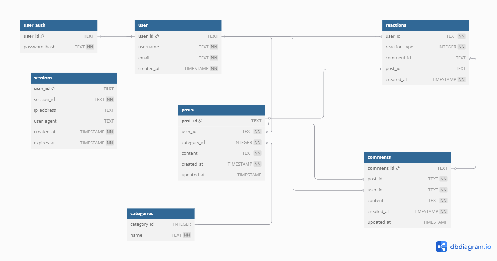

## Final db proposal

1. Let's keep it simple. This is a super basic project and we do not need to overcomplicate things.
2. We do not need to store any uneccessary stuff.
3. Store simple basic stuff and everything else can be checked in the backend.
4. It's a minimal yet super solid foundation, to keep us focused on the building part of the project.
5. If we, for any reason, need to store some extra data on the database we will need to just create a new one. We are not in production, and we stil learn.

